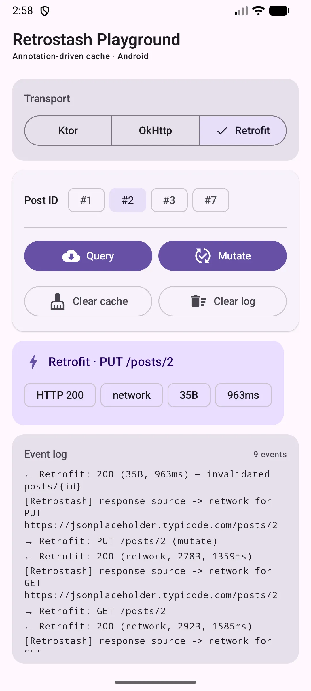
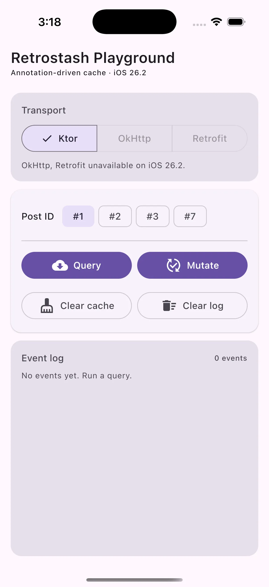
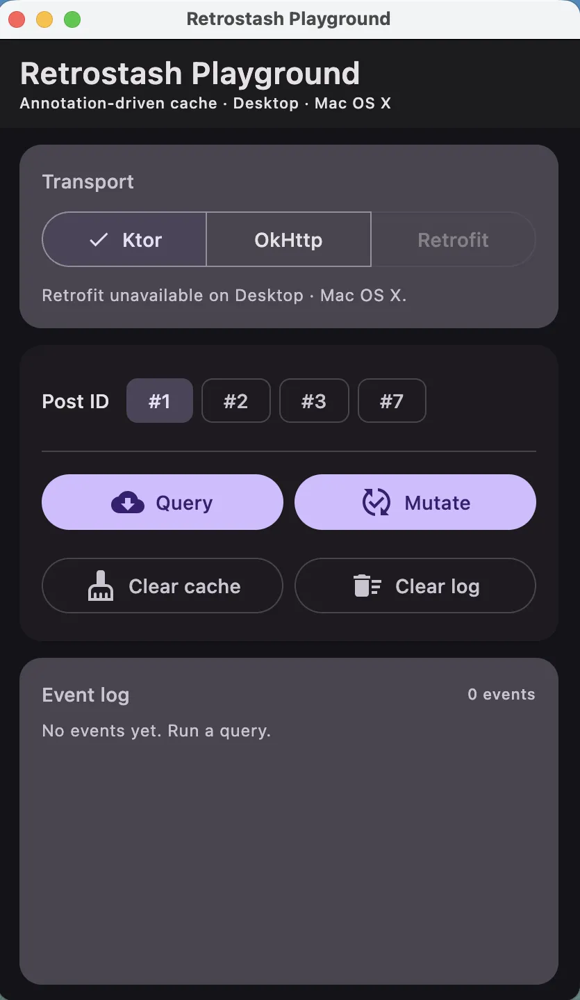
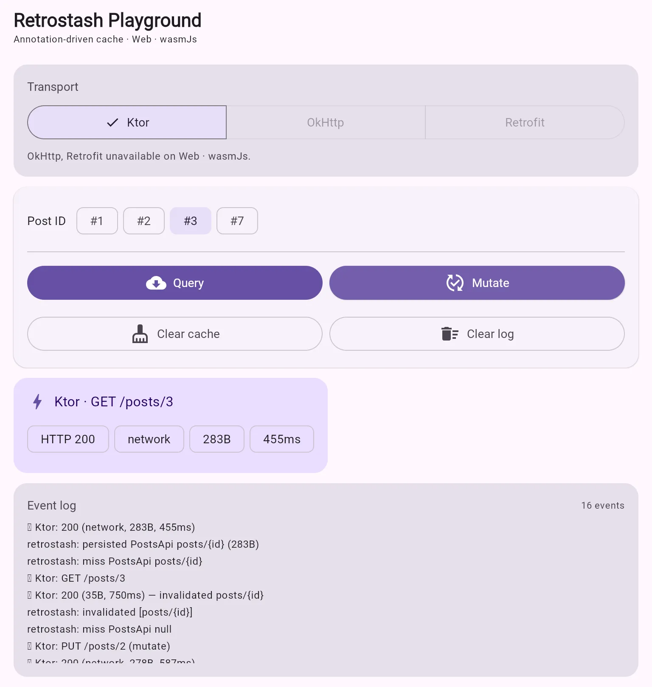

# Retrostash

**Retrostash** is an annotation-driven caching layer for Retrofit, OkHttp, and Ktor. It solves two
pain points in Kotlin networking: caching non-idempotent queries (like `POST` searches or GraphQL)
and automatically invalidating cached data when mutations occur. Available as a Kotlin Multiplatform
library targeting Android, JVM, and iOS.

[](https://github.com/logickoder/retrostash/releases)

| Android                                                                                       | iOS                                                                                   |
|-----------------------------------------------------------------------------------------------|---------------------------------------------------------------------------------------|
|  |  |
| **Desktop**                                                                                   | **Web (wasmJs)**                                                                      |
|  |  |

> Sample app `:composeApp` runs on Android, JVM desktop, iOS, and wasmJs (browser). Switch between
> Ktor, OkHttp, and Retrofit transports via the segmented tab.
>
> 🌐 **[Live web demo](https://logickoder.github.io/retrostash/)** ·
> 📦 [Android APK + Web bundle](https://github.com/logickoder/retrostash/releases) attached to each
> release.

### Key Features
- **Persisted POST query caching:** Safely cache complex payloads like searches and GraphQL.
- **Mutation-driven cache invalidation:** Automatically clear stale data when a user updates a resource.
- **Dynamic key resolution:** Cache templates are resolved directly from `@Path`, `@Query`, and `@Body` parameters.
- **HTTP cache friendliness:** GET cache header policies that work seamlessly with OkHttp.
- **Multiplatform:** Core engine + annotations + Ktor plugin run on Android, JVM, and iOS. OkHttp
  adapter runs on Android + JVM.

### 100% Converter Agnostic

Retrostash intercepts the raw `RequestBody` (OkHttp) or `HttpRequestBuilder` attributes (Ktor). Key
resolution works with plain Kotlin objects, Maps, Arrays, JSON bytes — no `Gson`/`Moshi`/
`kotlinx.serialization` lock-in.

---

## Modules

| Module                   | Targets                                           | Purpose                                          |
|--------------------------|---------------------------------------------------|--------------------------------------------------|
| `retrostash-core`        | android, jvm, iosX64, iosArm64, iosSimulatorArm64 | Engine, key resolver, in-memory store            |
| `retrostash-annotations` | android, jvm, ios*                                | `@CacheQuery`, `@CacheMutate`                    |
| `retrostash-ktor`        | android, jvm, ios*                                | Ktor `HttpClient` plugin                         |
| `retrostash-okhttp`      | android, jvm                                      | OkHttp interceptor + Retrofit metadata extractor |

---

## Public API

**Primary surface:**
- `@CacheQuery(key = "...")`
- `@CacheMutate(invalidate = ["..."])`
- `RetrostashStore`, `InMemoryRetrostashStore`, `RetrostashEngine` (core)
- `RetrostashPlugin`, `retrostashQuery`, `retrostashMutate` (ktor)
- `RetrostashOkHttpBridge`, `RetrostashOkHttpAndroid` (okhttp)

---

## Integration

### Android / JVM (Gradle)

```kotlin
// settings.gradle.kts
dependencyResolutionManagement {
    repositories {
        google()
        mavenCentral()
    }
}
```

```kotlin
// module build.gradle.kts
dependencies {
    implementation("dev.logickoder:retrostash-core:0.0.5")
    implementation("dev.logickoder:retrostash-annotations:0.0.5")
    // pick your transport:
    implementation("dev.logickoder:retrostash-okhttp:0.0.5")
    // or
    implementation("dev.logickoder:retrostash-ktor:0.0.5")
}
```

### iOS (Swift Package Manager)

In Xcode: **File → Add Packages…** → enter `https://github.com/logickoder/retrostash` and pick the
version. The `Retrostash` product bundles core + annotations + Ktor plugin as a single XCFramework.

```swift
import Retrostash
```

---

## OkHttp / Retrofit (Android)

```kotlin
interface UserApi {
    @CacheQuery("users/{id}?tenant={tenant}")
    @POST("users/{id}")
    suspend fun getUser(
        @Path("id") id: String,
        @Body req: UserRequest,
    ): UserResponse

    @CacheMutate(invalidate = ["users/{id}?tenant={tenant}"])
    @POST("users/{id}/update")
    suspend fun updateUser(
        @Path("id") id: String,
        @Body req: UpdateUserRequest,
    ): UpdateUserResponse
}
```

```kotlin
val cache = Cache(File(appContext.cacheDir, "http-cache"), 10L * 1024 * 1024)
val okHttpBuilder = OkHttpClient.Builder().cache(cache)

val bridge = RetrostashOkHttpAndroid.install(
    builder = okHttpBuilder,
    context = appContext,
    config = RetrostashOkHttpConfig(logger = { Log.d("Retrostash", it) }),
)

val okHttpClient = okHttpBuilder.build()
val sameBridge = RetrostashOkHttpBridge.from(okHttpClient)
```

JVM (non-Android) consumers construct `RetrostashOkHttpBridge` directly with their own
`RetrostashStore` impl — no `Context` needed.

## Ktor (KMP)

```kotlin
val store = InMemoryRetrostashStore()
val client = HttpClient {
    install(RetrostashPlugin) {
        this.store = store
        timeoutMs = 250
        logger = { println(it) }
    }
}

client.get("https://api.example.com/feed/7") {
    retrostashQuery(
        scopeName = "FeedApi",
        template = "feed/{id}",
        bindings = mapOf("id" to "7"),
        maxAgeMs = 60_000L,
    )
}

client.post("https://api.example.com/feed/7") {
    retrostashMutate(
        scopeName = "FeedApi",
        invalidateTemplates = listOf("feed/7"),
        bindings = mapOf("id" to "7"),
    )
}
```

---

## Template Rules

Templates use `{placeholder}` syntax. Placeholder sources:
- `@Path("name")`
- `@Query("name")`
- Matching field names found recursively in `@Body`

If any placeholder cannot be resolved, the key is treated as unresolved and the cache action is
skipped safely.

When using `@CacheMutate`, include every related query template in `invalidate`, including POST-based query templates if you use `@CacheQuery` on POST endpoints.

## Clearing Cache

```kotlin
RetrostashOkHttpAndroid.clear(appContext)
// or for any RetrostashStore:
store.clear()
```

## External Invalidation

```kotlin
val bridge = RetrostashOkHttpBridge.from(okHttpClient) ?: return
bridge.invalidateQuery(
    apiClass = UserApi::class.java,
    template = "users/{id}?tenant={tenant}",
    bindings = mapOf("id" to "42", "tenant" to "acme"),
)
```

## Migrating from 0.0.4

| Old (0.0.4)                                                | New (0.0.5)                                                              |
|------------------------------------------------------------|--------------------------------------------------------------------------|
| `Retrostash.install(builder, context)`                     | `RetrostashOkHttpAndroid.install(builder, context)`                      |
| `Retrostash.from(client)`                                  | `RetrostashOkHttpBridge.from(client)`                                    |
| `Retrostash.clear(context)`                                | `RetrostashOkHttpAndroid.clear(context)`                                 |
| `RetrostashConfig`                                         | `RetrostashOkHttpConfig` (OkHttp) or `RetrostashConfig` (Ktor)           |
| `PostResponseCacheStore`                                   | `RetrostashStore` + `InMemoryRetrostashStore` / `AndroidRetrostashStore` |
| `NetworkCachePolicyInterceptor`, `CacheControlInterceptor` | merged into `RetrostashOkHttpInterceptor`                                |
| JitPack coords `com.github.logickoder:retrostash`          | Maven Central coords `dev.logickoder:retrostash-*`                       |

## Notes

- For OkHttp, the bridge installs both an application interceptor (handle/marker) and a network
  interceptor (cache-control rewrites). Use `RetrostashOkHttpAndroid.install` to wire them in the
  right order automatically.
- For Ktor, response persistence happens on 2xx only; invalidation also gates on 2xx. Non-2xx
  responses leave the cache untouched.

## Contributing and Releases

See [CONTRIBUTING.md](CONTRIBUTING.md) and [development.md](development.md) for:
- Contribution workflow
- Local Maven publishing (`./gradlew publishToMavenLocal`)
- iOS XCFramework build (`./gradlew :retrostash-ktor:assembleRetrostashReleaseXCFramework`)
- Release/versioning flow
